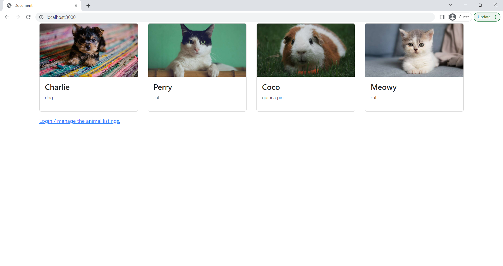
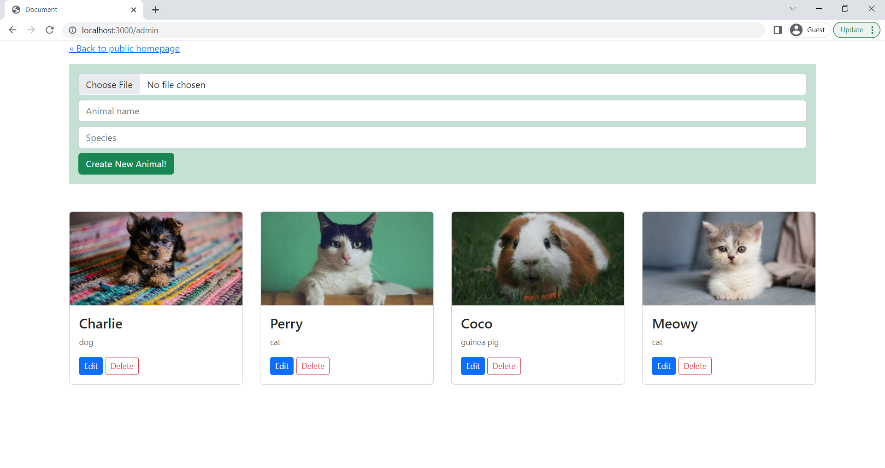
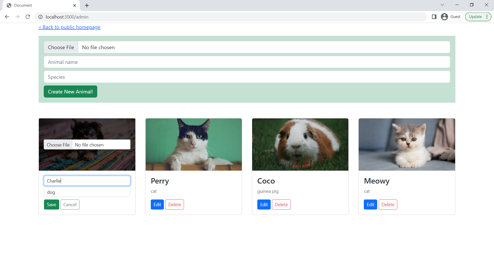
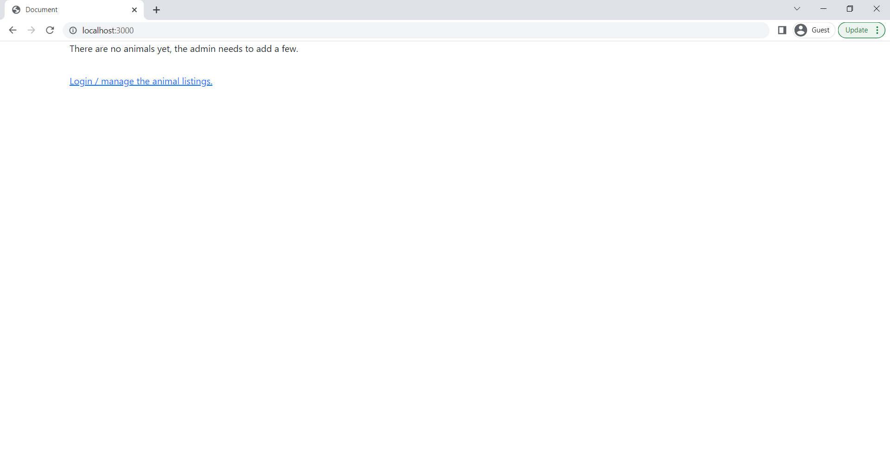

# Pet Listings Using the MERN Stack
This pet listings web app was built using the MERN Stack **(MongoDB, Express, React, Node)**. The database is hosted using **MongoDB Compass** and **Docker**.

### Credits for images
<a href="https://unsplash.com/">Images from Unsplash</a>
